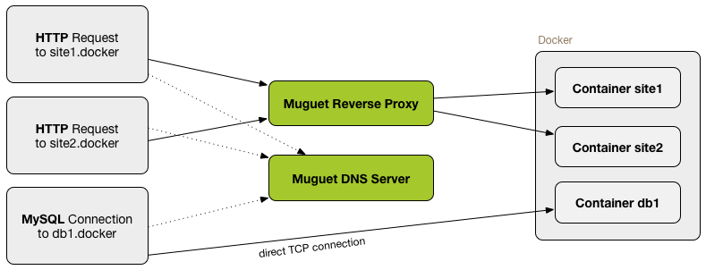

# Muguet

[](https://coveralls.io/github/mattallty/docker-http-reverse-proxy?branch=master)

## Introduction

When using Docker, it's sometimes a pain to access your containers using specific IPs/ports.
Muguet provides you with a DNS Server that resolves auto-generated hostnames to your containers IPs,
plus a reverse proxy to access all your web apps on port 80. 



## Prerequisites

  - A running [Docker](https://www.docker.com/) environment
  - [Node.js](https://nodejs.org/) or [io.js](https://iojs.org)
  

## Install

 1. Install Muguet
```bash
npm install -g muguet
```

 2. Setup a new resolver
 
Create a file `/etc/resolver/docker` with teh following content: 

```
nameserver 127.0.0.1
port: 9999
```
 

## Usage

```bash
sudo muguet [options]

# or
sudo -E bash -c 'muguet [options]'

```

Notes:
  - Muguet must be run as *root* to be able to bind port 80
  - `sudo -E bash -c 'muguet [options]'` is recommended as it allows you to pass environment variables, such as *DOCKET_HOST*,
    from the sudoer to the executed command run as *root*.


If you are using Docker Compose, let's say your `docker-compose.yml` looks like the following:

```yml
site1:
  build: ./build/docker/site1
  ports:
    - "80"
    
site2:
  build: ./build/docker/site2
  ports:
    - "80"    
```
    
Using an HTTP reverse proxy will allow you to access these containers using the following URLs:

- http://site1.docker
- http://site2.docker

*Note that domain and sub-domain are customizable.*

## Domain name resolution

There is no magic here, so you will have to make your system resolve  `*.docker` (or whatever domain you choose)
to the Proxy container IP address. 

So you have 2 choices:

#### 1. Updating your local `/etc/hosts` file

In this case case, this repository provide you with a daemon you can use to automatically update your `/etc/hosts` file
whenever a container is launched or stopped. See [`bin/etc-hosts-updater.js`](bin/etc-hosts-updater.js) and associated
[documentation](README-etc-hosts.md).

#### 2. Using a DNS service 

Make use of a DNS service that will resolve `*.docker` (or whatever domain you choose) to the Proxy container IP address.


---


## How it works
    
The reverse-proxy is itself a container that you will have to put in your `docker-compose.yml`.

So you config would look like this:

```yml
site1:
  build: ./build/docker/site1
  ports:
    - "80"
  labels:
    - "org.dc.http-proxy.enabled=1"  
    
site2:
  build: ./build/docker/site2
  ports:
    - "80"    
  labels:
    - "org.dc.http-proxy.enabled=1"
      
proxy:
  image: mattallty/docker-http-reverse-proxy
  ports:
    - "80:80"     
```

**Important**: The proxy must specifically **bind the port 80 on the host**, and must be **the only one** to do so!

### Not using Docker Compose ?

You can also use this proxy without using *Docker Compose*.
In this case, the sub-domain name will be taken either from you container *label* named `org.dc.http-proxy.sub-domain`,
if it is present, or from the container id itself (but will be much less memorable).
Obviously, you will also have to set the *label* `org.dc.http-proxy.enabled=1` on your containers.

---

## Labels

Docker `labels` are used as configuration settings. Here is the list of recognized labels:

#### org.dc.http-proxy.enabled

Set it to 1 to enable proxying to the service.

Example:

```yml
site1:
  build: ./build/docker/site1
  ports:
    - "80"
  labels:
    - "org.dc.http-proxy.enabled=1"  # Enable proxying for this container
```

#### org.dc.http-proxy.sub-domain

Used to specify a sub-domain. By default, the compose service name is used, ie `site1` or `site2` in the example.

Example:

```yml
site1:
  build: ./build/docker/site1
  ports:
    - "80"
  labels:
    - "org.dc.http-proxy.enabled=1"
    - "org.dc.http-proxy.sub-domain=foo" # Will serve this container on http://foo.docker
```

#### org.dc.http-proxy.only-ports

A comma-separated list of ports that you want to proxify. Useful if one of your containers expose multiple ports, 
but some of them don't need to be proxied.

Example:

```yml
site1:
  build: ./build/docker/site1
  ports:
    - "80"
    - "8888"
    - "3306"
  labels:
    - "org.dc.http-proxy.enabled=1"
    - "org.dc.http-proxy.only-ports=80,8888"  # Will only proxify ports 80 and 8888
```


#### org.dc.http-proxy.web-port 

The port to proxify on port 80. 
Useful if one of your containers expose multiple ports, but you want that a specific one maps to port 80.

Example:

```yml
site1:
  build: ./build/docker/site1
  ports:
    - "9999"
    - "8888"
  labels:
    - "org.dc.http-proxy.enabled=1"
    # Will only proxify port 8888 on 80, and port 9999 to another one.
    - "org.dc.http-proxy.web-port=8888"
```

## Examples

### Custom sub-domain

This will use use `foo` as sub-domain instead if `site1`, so you service will be accessible on `http://foo.docker`.

```yml
site1:
  build: ./build/docker/site1
  ports:
    - "80"
  labels:
    - "org.dc.http-proxy.enabled=1"  
    - "org.dc.http-proxy.subdomain=foo"
```

### Multiple ports

**Warning**: This example is not an ideal example as it is contrary to the micro-service dogma.
You would better slice your services into smaller pieces.

Let's say one of your containers listen on several ports in order to 
run apache on port 80, a node.js app that listen on port 8888, and mysql on port 3306.

So you only want to proxify apache and nodejs. 

```yml
## WORKS BUT NOT A IDEAL
app:
  build: ./build
  ports:
    - "80"
    - "8888:8888"
    - "3306"
  labels:
    - "org.dc.http-proxy.enabled=1"  # Enable proxy on this container
    - "org.dc.http-proxy.only-ports=80,8888" # Only proxy these ports
    
proxy:
  image: mattallty/docker-http-reverse-proxy
  ports:
    - "80:80"
```

With this config, apache will be accessible via `http://app.docker` and nodejs via `http://app.docker:8888`.
Notice that Apache has been given the port 80 on the proxy by priority (80 is privileged).

This solution is not good as you have to statically fix the port binding of 8888. 

As a **better solution**, you can write:
    
```yml
## MUCH BETTER
app:
  build: ./build
  ports:
    - "80"
    - "8888:8888"
    - "3306"
  labels:
    # Enable proxy on this container
    - "org.dc.http-proxy.enabled=1"
    # Only proxy these ports
    - "org.dc.http-proxy.only-ports=80,8888"
    # Will proxify the port 80 on http://apache.docker
    - "org.dc.http-proxy.port-80-subdomain=apache"
    # Will proxify port 8888 on http://nodejs.docker
    - "org.dc.http-proxy.port-8888-subdomain=nodejs"
    
proxy:
  image: mattallty/docker-http-reverse-proxy
  ports:
    - "80:80"
```    

## Custom domain

By default, the proxy uses `dock.dev` as domain. 
You can change it by passing the env var `HTTP_PROXY_DOMAIN` to the proxy container:

```yml
# [...]
    
proxy:
  image: mattallty/docker-http-reverse-proxy
  ports:
    - "80:80"
  environment:
    - "HTTP_PROXY_DOMAIN=mydomain.local"
    
# [...]    
```    

## REST API

A REST API is available on port `9876` to retrieve the proxy 
status and configuration. You can customize the port by passing 
the environment variable var `HTTP_PROXY_API_PORT` to the proxy 
container:

```yml
# [...]
    
proxy:
  image: mattallty/docker-http-reverse-proxy
  ports:
    - "80:80"
  environment:
    - "HTTP_PROXY_API_PORT=7777"
    
# [...]    
```    
